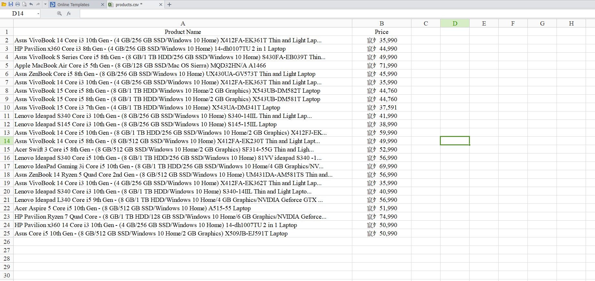

# Flipkart_WebScraping

Code to extract all the data related to that particular page from Flipkart and saying the data in csv format in same directory as products.csv

Data retrieved:
- Product Name
- Price

